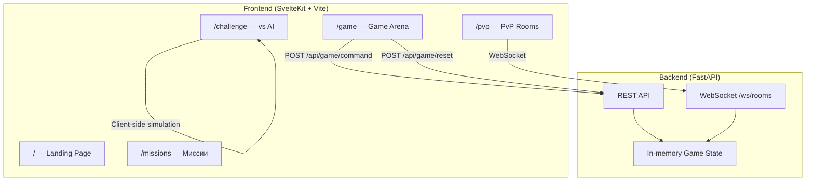
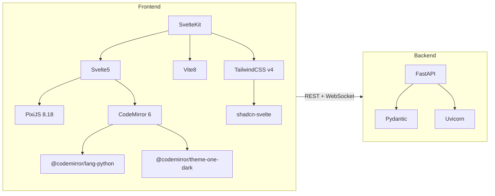

# 🎮 Battle City: Code Arena — Полный анализ кода

## Общая оценка

**Проект значительно продвинулся** относительно описания в TZ.md (где он назван v0.1.0 с пустыми директориями). Реально это уже **рабочий MVP (~v0.3)** с функционирующими frontend и backend, тремя игровыми режимами и пиксельным UI.

---

## 📊 Сводка по кодовой базе

| Метрика | Значение |
|---|---|
| **Frontend фреймворк** | SvelteKit 2.57 + Svelte 5 (Runes) |
| **CSS** | TailwindCSS v4 + кастомная дизайн-система |
| **Игровой движок** | PixiJS 8.18 |
| **Редактор кода** | CodeMirror 6 (Python) |
| **Backend** | FastAPI (Python) |
| **Основные файлы** | ~10 ключевых |
| **Маршруты frontend** | 5 (`/`, `/game`, `/missions`, `/challenge`, `/pvp`) |
| **API эндпоинтов backend** | 7 (REST + 1 WebSocket) |

---

## 🏗️ Архитектура

---

## 🔍 Детальный анализ по модулям

### 1. Backend — [main.py](file:///c:/Users/User/Desktop/cafe-order/battle-city-code-arena/backend/app/main.py) (375 строк)

**Весь backend в одном файле.** Включает:

#### API эндпоинты:
| Метод | URL | Назначение |
|---|---|---|
| `GET` | `/` | Health check |
| `GET` | `/api/game/state` | Текущее состояние танка |
| `POST` | `/api/game/reset` | Сброс миссии (1–6) |
| `POST` | `/api/game/command` | Выполнить команду (`move`, `rotate`, `scan`, `fire`) |
| `GET` | `/api/level/1` | Данные уровня 1 (захардкожено) |
| `POST` | `/api/rooms` | Создать PvP-комнату |
| `POST` | `/api/rooms/{code}/join` | Войти в PvP-комнату |
| `WS` | `/ws/rooms/{code}/{slot}` | WebSocket для PvP боя |

#### Игровая логика:
- **6 миссий** с разными картами стен и позициями врагов
- **AI врагов** — стреляет при прямой видимости, иначе двигается к игроку
- **PvP-система** — комнаты с кодом, 30-секундные бои, WebSocket-синхронизация
- **Типы стен**: `brick` (разрушаемые) и `steel` (неразрушаемые)

#### Схемы данных — [game.py](file:///c:/Users/User/Desktop/cafe-order/battle-city-code-arena/backend/app/schemas/game.py):
- `TankState`, `EnemyState`, `WallState`, `Command`, `CommandResult`
- Константы: `ROTATE_CW`, `MOVE_DELTA`

---

### 2. Frontend — Главная страница [+page.svelte](file:///c:/Users/User/Desktop/cafe-order/battle-city-code-arena/frontend/src/routes/+page.svelte) (255 строк)

- **Пиксельный ретро-дизайн** в стиле 8-bit
- **PixiJS превью** — вращающийся танк-спрайт
- **Навигация**: Missions, Challenge vs AI, PvP Rooms, Academy
- **Секции**: Hero, Mission Protocol (4 шага), Battle Simulator Preview
- **Кнопка `START_HACKING`** — проверяет доступность backend

---

### 3. Frontend — Game Arena [/game/+page.svelte](file:///c:/Users/User/Desktop/cafe-order/battle-city-code-arena/frontend/src/routes/game/+page.svelte) (1027 строк) ⭐ Ключевой файл

**Полноценная IDE-like среда:**

- **CodeMirror 6** — Python-редактор с:
  - Кастомной ретро-темой (`retroTheme`)
  - Автодополнением команд танка (`move`, `rotate`, `scan`, `fire`)
  - Подсветкой синтаксиса Python
  - Tab-завершением, историей, скобками

- **PixiJS 8 арена** — карта 10×8 клеток:
  - Спрайты танков с 4 направлениями (sprite sheet 2×2)
  - Анимация движения (lerp 300ms)
  - Анимация выстрела (пуля летит через карту)
  - Спрайты стен (brick/steel из Kenney)
  - Целевая точка "B" с подсветкой

- **Парсер Python-кода** — клиентский:
  - Поддерживает `move()`, `rotate()`, `scan()`, `fire()`
  - Поддерживает `for i in range(N):` с телом
  - Ограничение: `MAX_REPEAT = 100`

- **Боковая панель**: кнопки вставки команд
- **Системный терминал**: логи с цветовой кодировкой
- **Хедер**: позиция, направление, HP, score, цель миссии

---

### 4. Frontend — Missions [/missions/+page.svelte](file:///c:/Users/User/Desktop/cafe-order/battle-city-code-arena/frontend/src/routes/missions/+page.svelte) (116 строк)

Каталог миссий — 6 карточек с:
- Названием и сложностью
- Целями и подсказками
- Ориентиром по кол-ву команд
- Ссылкой на `/game?mission=N`

---

### 5. Frontend — Challenge vs AI [/challenge/+page.svelte](file:///c:/Users/User/Desktop/cafe-order/battle-city-code-arena/frontend/src/routes/challenge/+page.svelte) (393 строки)

**Полностью клиентский бой** (не использует backend!):
- 60 секунд на подготовку кода
- 30-секундный бой с тиками каждые 420мс
- AI логика: стреляет при прямой видимости, иначе идёт к игроку
- Анимация пуль, разрушаемые стены
- CodeMirror для редактирования стратегии

---

### 6. Frontend — PvP Rooms [/pvp/+page.svelte](file:///c:/Users/User/Desktop/cafe-order/battle-city-code-arena/frontend/src/routes/pvp/+page.svelte) (273 строки)

**Мультиплеер через WebSocket:**
- Создание/вход по 6-символьному коду
- CSS-based отрисовка поля (grid 10×8 div'ов)
- Программы зацикливаются на 30 секунд
- Визуализация выстрелов, HP, статус боя

---

### 7. Дизайн-система [layout.css](file:///c:/Users/User/Desktop/cafe-order/battle-city-code-arena/frontend/src/routes/layout.css) (177 строк)

Кастомная **Material Design 3 — Pixel Edition**:
- 40+ CSS-переменных (цвета surface, primary, secondary, tertiary, error)
- TailwindCSS v4 `@theme inline` — все цвета доступны как утилиты
- Компоненты: `.pixel-shadow`, `.pixel-border`, `.pixel-btn`
- Шрифт: Space Mono (Google Fonts)
- Кастомный пиксельный скроллбар
- `border-radius: 0 !important` — всё угловатое

---

## ✅ Что сделано хорошо

1. **Три полноценных игровых режима** — миссии, challenge vs AI, PvP
2. **IDE-like интерфейс** — CodeMirror с автодополнением, терминал, боковая панель
3. **Продуманная дизайн-система** — цельный ретро-пиксельный стиль
4. **PixiJS рендеринг** — анимации движения, стрельбы, спрайты
5. **WebSocket PvP** — реалтайм мультиплеер
6. **Клиентский парсер Python** — поддержка циклов `for/range`
7. **Отличные ассеты** — Kenney CC0 спрайты стен и врагов, кастомные спрайты танков

---

## ⚠️ Проблемы и технический долг

### 🔴 Критические

| # | Проблема | Файл |
|---|---|---|
| 1 | **Весь backend в одном файле** (375 строк). Роуты, логика, состояние, PvP — всё в `main.py`. Нужно разбить на модули. | [main.py](file:///c:/Users/User/Desktop/cafe-order/battle-city-code-arena/backend/app/main.py) |
| 2 | **Глобальное мутабельное состояние** — `tank`, `enemy`, `walls` как глобальные переменные. Один сервер = один игрок. Нет сессий. | [main.py:20-33](file:///c:/Users/User/Desktop/cafe-order/battle-city-code-arena/backend/app/main.py#L20-L33) |
| 3 | **PvP rooms in-memory** — все комнаты теряются при перезапуске сервера. Нет очистки старых комнат (утечка памяти). | [main.py:37](file:///c:/Users/User/Desktop/cafe-order/battle-city-code-arena/backend/app/main.py#L37) |
| 4 | **Docker не настроен** — `docker-compose.yml` и `Dockerfile` пустые. | [docker-compose.yml](file:///c:/Users/User/Desktop/cafe-order/battle-city-code-arena/docker-compose.yml) |

### 🟡 Средние

| # | Проблема | Файл |
|---|---|---|
| 5 | **Дублирование игровой логики** — карты миссий, AI и механики дублируются между backend и `/challenge`. Challenge вообще не использует backend. | [challenge/+page.svelte](file:///c:/Users/User/Desktop/cafe-order/battle-city-code-arena/frontend/src/routes/challenge/+page.svelte) |
| 6 | **Game page 1027 строк** — огромный монолитный компонент. Нужно разбить на подкомпоненты (Editor, Arena, Terminal, Sidebar). | [game/+page.svelte](file:///c:/Users/User/Desktop/cafe-order/battle-city-code-arena/frontend/src/routes/game/+page.svelte) |
| 7 | **Нет валидации** — парсер Python примитивный (regex). Нет вложенных циклов, условий, переменных. | [game/+page.svelte:719-755](file:///c:/Users/User/Desktop/cafe-order/battle-city-code-arena/frontend/src/routes/game/+page.svelte#L719-L755) |
| 8 | **PvP рендеринг CSS-based** — поле 10×8 через div'ы, в то время как missions/game используют PixiJS. Визуальная несогласованность. | [pvp/+page.svelte:243-266](file:///c:/Users/User/Desktop/cafe-order/battle-city-code-arena/frontend/src/routes/pvp/+page.svelte#L243-L266) |
| 9 | **`/api/level/1` захардкожен** — не используется нигде, данные миссий дублируются на фронте. | [main.py:358-374](file:///c:/Users/User/Desktop/cafe-order/battle-city-code-arena/backend/app/main.py#L358-L374) |
| 10 | **`.env` пуст** — нет конфигурации. API URL захардкожен на `localhost:8000`. | [.env](file:///c:/Users/User/Desktop/cafe-order/battle-city-code-arena/.env) |

### 🟢 Незначительные

| # | Проблема | Файл |
|---|---|---|
| 11 | **Нет SEO** — у главной страницы нет `<svelte:head>` (нет title, meta). | [+page.svelte](file:///c:/Users/User/Desktop/cafe-order/battle-city-code-arena/frontend/src/routes/+page.svelte) |
| 12 | **Нет мобильной адаптации** — Game Arena заточена под десктоп (фиксированная ширина 680px). | [game/+page.svelte:978](file:///c:/Users/User/Desktop/cafe-order/battle-city-code-arena/frontend/src/routes/game/+page.svelte#L978) |
| 13 | **Нет обработки ошибок WebSocket** — при обрыве соединения PvP просто пишет "закрыто". Нет переподключения. | [pvp/+page.svelte:93-95](file:///c:/Users/User/Desktop/cafe-order/battle-city-code-arena/frontend/src/routes/pvp/+page.svelte#L93-L95) |
| 14 | **Дизайн-директория** с прототипами не интегрирована в проект. | [design/](file:///c:/Users/User/Desktop/cafe-order/battle-city-code-arena/design) |
| 15 | **Пустые директории backend**: `models/`, `simulator/`, `levels/` — не используются. | [backend/app/](file:///c:/Users/User/Desktop/cafe-order/battle-city-code-arena/backend/app) |

---

## 📐 Карта зависимостей

---

## 📈 Рекомендации по приоритетам

### Приоритет 1 — Архитектура
1. Разбить `main.py` на модули: `routes/`, `services/`, `models/`
2. Ввести сессии (cookie/token) для поддержки нескольких игроков
3. Разбить `game/+page.svelte` на компоненты

### Приоритет 2 — Функциональность
4. Унифицировать Challenge vs AI — использовать backend API вместо клиентской логики
5. Перевести PvP на PixiJS рендеринг
6. Добавить сохранение прогресса (база данных или localStorage)

### Приоритет 3 — Инфраструктура
7. Настроить Docker (Dockerfile + docker-compose)
8. Добавить `.env` конфигурацию
9. Добавить тесты (pytest для backend, vitest для frontend)

### Приоритет 4 — Полировка
10. SEO мета-теги
11. Мобильная адаптация
12. Переподключение WebSocket
